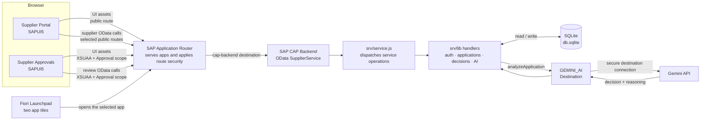

# Supplier Management — Technical Project Report

## 1. Project overview

Supplier Management is a supplier onboarding application: suppliers create an account, submit a profile and certificate, track the review, and resubmit if asked to revise. Approvers use a separate protected application to inspect submissions, approve or reject them, request specific revisions, and optionally get an AI-assisted certificate assessment.

The solution uses SAPUI5 for the two browser applications, the SAP Application Router for routing and access control, SAP CAP for the OData backend, and SQLite by default for persistence. In a hybrid/cloud setup it uses XSUAA for approver authorization and a Destination for the Gemini AI connection.

## 2. Architecture and request flow

The browser loads one of the SAPUI5 apps via the approuter. For calls matched by an OData route, the approuter forwards the request to the `cap-backend` destination. CAP dispatches the operation through the service implementation to a handler, which reads or writes the database. Certificate analysis is the exception to the usual database-only path: CAP reads the PDF, calls the configured `GEMINI_AI` destination, validates the response, and stores the resulting decision and reasoning.

The root launchpad route and approver app route require XSUAA authentication; the supplier UI assets and selected supplier API routes are configured as unauthenticated at the approuter. Exact route behavior is described in section 8. The local launchpad is a development convenience; deployed authentication and services depend on the configured platform bindings and routes.

## 3. Database layer — `db/schema.cds`

The schema declares namespace `supplier.management`. Both entities use CAP's `cuid` aspect for generated IDs. `Suppliers` also uses `managed`, which adds standard creation/modification timestamps and user metadata.

### `Suppliers`

Each row represents a supplier's current application.

- `ID`: generated unique identifier.
- `companyName`: supplier's registered company name; required, up to 100 characters.
- `contactPerson`: primary contact; required, up to 100 characters.
- `email`: contact email recorded with the application; optional in the schema.
- `phone`: phone number, up to 30 characters.
- `country`: supplier's country, up to 100 characters.
- `category`: supplier category, up to 50 characters.
- `taxNumber`: tax identifier, up to 50 characters.
- `website`: company website, up to 255 characters.
- `address`: supplier address, up to 500 characters.
- `notes`: additional supplier information, up to 2,000 characters.
- `certificate`: certificate file stored as binary data. Its media type is associated with `certificateMimeType`.
- `certificateMimeType`: MIME type of the stored certificate.
- `status`: workflow state, defaulting to `SUBMITTED`; handlers use `SUBMITTED`, `APPROVED`, and `REJECTED`.
- `submittedAt`: timestamp of the current submission or re-submission.
- `submittedBy`: normalized email used by supplier-side handlers to find the user's application.
- `rejectionComment`: approver's rejection explanation, or an AI-marked explanation after AI rejection.
- `approvalComment`: optional approval explanation; AI approval reasoning is stored here.
- `revisionFields`: comma-separated field names the supplier is asked to revise.
- Managed fields: CAP-maintained creation/modification timestamps and user values.

### `Users`

Each row represents a supplier login account.

- `ID`: generated unique identifier.
- `email`: required account email. A unique constraint prevents duplicate user emails.
- `passwordHash`: required bcrypt password hash; the plaintext password is never stored.

The schema does not declare a relational association between a user and an application. The handler logic associates them by matching the normalized email to `Suppliers.submittedBy`.

## 4. Service contract — `srv/service.cds`

`SupplierService` exposes the backend over OData. `Suppliers` is a projection of the database entity and is marked for `READ` by users with the `Approval` role. Individual operations also have `@requires` declarations: most supplier operations use `any`, while the decision and AI operations explicitly require `Approval`. The approuter applies additional route-level rules described later.

The service defines four response types. `AuthResult` returns success, a message, and email. `SubmitResult` returns success and a message. `ApplicationStatus` reports whether an application exists and, if so, its status, rejection/revision information, submission time, and company name. `ApplicationDetails` returns supplier profile and reapplication details. `AIAnalysisResult` returns a decision and its reasoning.

### Supplier operations — `@requires: 'any'`

- `register(email, password)` creates a supplier account and returns `AuthResult`.
- `login(email, password)` checks supplier credentials and returns `AuthResult`.
- `myApplicationStatus(email)` returns a compact workflow status for the email.
- `myApplicationDetails(email)` returns the stored application information needed to populate a reapplication form.
- `submitApplication(...)` creates the first application. It takes supplier details and base64 certificate content, file name, and MIME type.
- `reapplyApplication(...)` updates a previously rejected application with allowed revisions and a new certificate.

### Approver operations — `@requires: 'Approval'`

- `decideApplication(ID, decision, comment, revisionFields)` stores an approver's approval or rejection and, for rejection, its explanation and requested changes.
- `analyzeApplication(ID, language)` asks Gemini to assess an application's certificate and returns a decision and reasoning.

The service contract describes what clients can call and the shape of data; actual validation and persistence are implemented in the handlers. The `certificateFileName` input is accepted by both submission operations but is not currently persisted or used by the handler.

## 5. Backend logic — `srv/lib/`

`srv/service.js` wires service events to the exported handler functions. It registers each operation from the authentication, application, and decision handler modules; it contains no business workflow of its own.

### `constants.js`

This file centralizes values shared by handlers: the database namespace, password and email patterns, bcrypt cost, PDF MIME type and signature, the 10 MB upload ceiling, minimum rejection-comment length, workflow statuses, and allowed revision fields. It also names the `GEMINI_AI` destination, Gemini API path, and request timeout. Keeping these together makes the rules consistent across backend operations.

`ALLOWED_REVISION_FIELDS` includes phone, country, category, tax number, website, address, notes, and certificate. Company name and contact person are deliberately not revisable. The reapplication merge logic applies only the profile fields it supports; a certificate revision is handled by requiring a new upload.

### `auth-handlers.js`

- `normalizeEmail(email)` trims and lowercases string email values. This makes account lookup and supplier application ownership consistent.
- `register(req)` requires email and password; validates email format and password complexity; rejects duplicate email; hashes the password with bcrypt; inserts the account; and returns success and normalized email.
- `login(req)` requires both fields, normalizes the email, looks up the user (with a raw-email fallback for legacy accounts), and compares the password against the stored hash. Unknown users and incorrect passwords receive the same error to avoid disclosing which credential was wrong.

The password rule is at least eight characters with uppercase, lowercase, numeric, and special characters. It is checked on the server even though the registration UI also displays the requirements.

### `application-handlers.js`

- `submitApplication(req)` normalizes and requires the submitter email, company name, and contact person, and requires a certificate. If provided, a phone may contain digits, spaces, `+`, and `-` only. The handler rejects a second application for the same submitter. It checks PDF MIME type, decoded file size (maximum 10 MB), and the `%PDF-` signature. It then inserts a `SUBMITTED` record with the certificate, submitter identity, and submission time.
- `reapplyApplication(req)` requires the user's existing application and permits reapplication only from `REJECTED`. It requires company and contact name inputs but preserves their existing stored values. It parses `revisionFields`, copies only flagged supported profile values from the request, and retains stored values for unflagged fields. It validates the merged phone value and requires a new PDF certificate, applying the same MIME, size, and signature checks as initial submission. It updates the existing row, returns its status to `SUBMITTED`, refreshes the time, replaces the certificate, and clears old decision/revision comments.
- `myApplicationStatus(req)` normalizes and requires the email and reads the matching application. If none exists, it returns `hasApplication: false` with null status details; otherwise it returns the status, submission time, company, rejection comment, and revision fields.
- `myApplicationDetails(req)` normalizes and requires the email, returns a not-found error if there is no application, and otherwise returns supplier profile fields plus rejection/revision details. It does not return the certificate binary.

These checks implement one initial submission per supplier, validated PDF upload, status tracking, and a controlled revise-and-resubmit workflow. The UI's checks improve user feedback but do not replace these server-side rules.

### `decision-handlers.js`

- `decideApplication(req)` requires an application ID and exactly `APPROVED` or `REJECTED`. Rejection requires a nonblank comment of at least 15 characters and at least one revision field. Every requested field must be in the allowed list. It checks that the application exists, then saves the status and decision data. Approval clears rejection and revision data; rejection saves the trimmed comment and comma-separated revision fields.
- `analyzeApplication(req)` finds the application and rejects missing or already-finalized records. It normalizes certificate data whether CAP supplies it as a buffer or stream, then requires nonempty content with PDF MIME type. It builds a Gemini prompt and sends the certificate through the configured destination, with a 30-second timeout. It parses and validates the returned JSON decision and reasoning; malformed or failed AI responses become explicit errors. Finally, it updates status, records the reasoning in the relevant approval/rejection comment, and flags the certificate for revision after an AI rejection.

`decideApplication` provides a human decision with actionable revision requests. `analyzeApplication` automates a document assessment but stores its result in the same workflow status fields; once decided, that record cannot be analyzed again through this handler.

## 6. Supplier Portal frontend

The Supplier Portal's bootstrap and app configuration live in `app/supplier-portal/webapp/index.html` and `manifest.json`. The manifest declares the UI5 libraries, English/Turkish resource model, root view, and routes for login, registration, and application. `Component.js` starts router navigation and sets the browser title from the translation bundle. `view/App.view.xml` is the shell that hosts routed pages.

### Login — `view/Login.view.xml`, `controller/Login.controller.js`

The login page presents email and password inputs, a show/hide password control, an error strip, and links to register. The controller posts credentials to `login`; on success it stores the returned email in browser `sessionStorage` and navigates to the application route. On server errors it displays a mapped message; on network failure it shows a connection error. This stored email is used as request context by the supplier UI; it is not itself an XSUAA-authenticated identity or signed token.

### Registration — `view/Register.view.xml`, `controller/Register.controller.js`

The registration page shows email and password inputs and an interactive checklist for the password requirements. On submit, the controller posts to `register`. On success it stores the returned email in `sessionStorage` and proceeds directly to the application form; on error it displays a localized message. This supports the intended account-creation-to-onboarding flow.

### Application, reapplication, and status — `view/Application.view.xml`, `controller/Application.controller.js`

The application view has two main states: the supplier form and an application-status display. On each route activation, the controller resets stale fields and checks `sessionStorage` for an email. It fetches `myApplicationStatus`; no existing application reveals the form, while an existing application reveals its company and ProcessFlow status. Rejected records show the rejection explanation and a reapply button.

The form collects company/contact details, optional supplier profile information, and a PDF certificate. The UI marks company name, contact person, and certificate as required. It gives early feedback for missing required inputs and rejects a selected file with the wrong MIME type or a size above 10 MB. A valid file is read as base64 and sent with the other fields to `submitApplication`. The backend additionally checks its actual signature and repeats the other essential validations.

For reapplication, the controller calls `myApplicationDetails`, fills the previous values, shows rejection reason and requested revision labels, locks company name and contact person, and enables only the flagged editable profile fields. It clears the certificate selection so a new certificate must be uploaded. Submission is then sent to `reapplyApplication`; a successful response refreshes the status display. The `ProcessFlow` visualizes submission, review, and final result for suppliers. Logout removes the saved email and returns to login.

`model/errorMapper.js` converts known backend validation messages into localized text. The English and Turkish bundles under `i18n/` supply labels, status text, field names, and error messages; translations keep the interface usable in both languages.

## 7. Supplier Approvals frontend

The approvals app is bootstrapped by `app/supplier-approvals/webapp/index.html`. Its `manifest.json` configures the OData V4 model for `/odata/v4/supplier/`, UI5 libraries, and English/Turkish translations. `Component.js` sets the approvals page title. `view/App.view.xml` defines the review table and toolbar, while `controller/App.controller.js` manages data, filters, dialogs, and actions.

The table lists company, contact, email, submission date, and status. Optional supplier-detail columns can be toggled. Status tabs show all, pending (`SUBMITTED`), approved, or rejected entries; the search field searches company, contact, and email. The settings fragment adds category filtering and sort choices by company name, contact, or submission date. The columns fragment controls optional columns, and Clear Filters resets search, tabs, sorting, category selection, and column visibility. `model/formatter.js` maps decision statuses to UI status colors; controller formatters localize statuses/categories and format submission dates.

Selecting a table row opens `view/SupplierDetails.fragment.xml`, a details dialog showing supplier profile, status ProcessFlow, decision comments, and a link to the stored certificate. For pending records the approver can approve, reject, or request AI analysis. The reject panel requires a comment of at least 15 characters and one or more revision checkboxes before enabling confirmation. The controller sends the selected fields and comment to `decideApplication`; the backend validates them again.

For protected action calls the controller first fetches a CSRF token, then posts to `decideApplication` or `analyzeApplication`. AI analysis sends the current UI language, shows a busy state, and updates the dialog's status and reasoning when it succeeds. Successful decisions refresh the table; errors are shown as localized toasts. The app's logout button navigates to the approuter logout endpoint. The approvals `model/errorMapper.js` translates known backend action errors for display.

The approvals English and Turkish bundles live in `app/supplier-approvals/webapp/i18n/`. They provide table, dialog, decision, status, and validation text for the localized reviewer experience.

## 8. Security layer — `xs-security.json`, `approuter/xs-app.json`

`xs-security.json` defines the XSUAA application name `supplier-management` in dedicated tenant mode. It declares the `$XSAPPNAME.Approval` scope, an `Approval` role template that includes that scope, and a `SupplierApprover` role collection that can be assigned to approvers. Its OAuth redirect URI allows the local approuter at `localhost:5000`.

`approuter/xs-app.json` uses route-based authentication and configures `/do/logout`. Its relevant route policy is:

- `/user-api...` uses XSUAA for user information.
- `/odata/v4/supplier/register`, `login`, `submitApplication`, and `reapplyApplication` are forwarded to `cap-backend` without approuter authentication or CSRF protection.
- `myApplicationStatus(...)` and `myApplicationDetails(...)` are also forwarded without approuter authentication.
- The launchpad root, `/index.html`, and `/appconfig/...` require XSUAA.
- Static assets are public. The supplier portal's static files are also public.
- The supplier approvals static files require XSUAA and the `Approval` scope.
- Remaining `/odata/...` requests require XSUAA and `Approval`, and use CSRF protection. This is how the protected approvals table and reviewer actions are routed.

The supplier frontend's `sessionStorage` email is therefore a client-supplied lookup/request value rather than proof of an authenticated supplier identity. As currently configured, public supplier endpoints accept an email parameter and the backend handlers use it to identify the application; they do not bind the value to an XSUAA user principal. This describes the implemented configuration, not a claim that those endpoints provide identity-level access control.

CAP's `@requires` annotations are an additional service-level authorization layer, but actual behavior depends on the selected CAP profile and authentication configuration. In the hybrid profile, `package.json` configures XSUAA and destinations; the default local profile uses SQLite and does not declare XSUAA authentication. In deployments, the app router and CAP service must be configured consistently.

## 9. AI integration

`analyzeApplication` is available to approvers. It reads the selected application's stored PDF, ensures there is content and the recorded MIME type is PDF, then converts the content to base64. The Gemini connection is configured in the root `package.json` as a REST service named `GEMINI_AI` that resolves credentials and endpoint through the Destination service; the handler posts to Gemini's `generateContent` path and enforces a 30-second timeout.

The prompt asks Gemini to decide `APPROVED` or `REJECTED` based on whether the file reasonably looks like a legitimate certificate or qualification record. It asks the model to check an expiry date when one is stated, reject clearly expired certificates with the date in its explanation, and avoid rejection for superficial formatting or minor inaccuracies. It asks for strict JSON with a short explanation in Turkish when the requested/accepted language begins with `tr`, otherwise English.

The handler parses and validates the decision and reasoning before updating the record. It sets the application status, saves the explanation with an `[AI Analysis]` prefix in the approval or rejection comment, and, for rejection, sets `revisionFields` to `certificate`. The UI displays the outcome and refreshes its table. The model's response is the workflow decision recorded by this path; the code does not describe an additional human confirmation step.

## 10. Fiori Launchpad

`app/appconfig/fioriSandboxConfig.json` configures a local Fiori launchpad sandbox with a Supplier Management catalog and group containing two static tiles: **Supplier Portal** and **Supplier Approvals**. Each tile has an icon, title, and semantic-object navigation target.

The sandbox's client-side target resolution maps those intents to `/supplier-portal/webapp/index.html` and `/supplier-approvals/webapp/index.html`. The launchpad provides a single entry point for the two user experiences; access to the approvals destination is still subject to the approuter's XSUAA route protection and the required Approval scope.

## Supporting project configuration

- Root `package.json` declares CAP, SQLite, bcrypt, XSUAA/connectivity dependencies and the default SQLite database at `db.sqlite`. Its hybrid profile adds XSUAA, Destination service, and the `GEMINI_AI` destination-backed REST service. `npm start:approuter` starts the router. The root `npm test` script is a placeholder and exits with an error rather than running a test suite.
- `approuter/package.json` declares the SAP Application Router dependency and starts it with `node server.js`.
- `approuter/server.js` creates the approuter server; its 403 page is `approuter/error/403.html`.
- `srv/server.js` configures Express JSON parsing up to 15 MB before starting the CAP server, allowing the base64 PDF request payloads to reach CAP.
- `readme.md` documents installation, local/hybrid startup, service paths, and high-level project layout.
- The project contains no `mta.yaml`; this repository's deployment configuration is expressed through the application/router files and external platform service bindings rather than a checked-in MTA descriptor.
